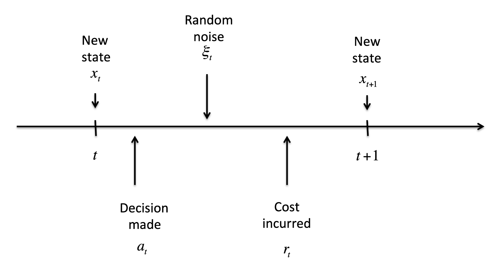

# Duality-driven Dynamic Programming (DDP) Algorithm
The Implementation of the paper "Information Relaxation and A Duality-Driven Algorithm for Stochastic Dynamic Programs"(https://arxiv.org/abs/2007.14295), minor revision under Operations Research. 

**Authors:** Nan Chen, Xiang Ma, Yanchu Liu, Wei Yu

## Abstract 
We use the technique of information relaxation to develop a duality-driven iterative
approach to obtaining and improving confidence interval estimates for the true value of
finite-horizon stochastic dynamic programming problems. We show that the sequence
of dual value estimates yielded from the proposed approach in principle monotonically
converges to the true value function in a finite number of dual iterations. Aiming
to overcome the curse of dimensionality in various applications, we also introduce a
regression-based Monte Carlo algorithm for implementation. The new approach can be
used not only to assess the quality of heuristic policies, but also to improve them if we
find that their duality gap is large. We obtain the convergence rate of our Monte Carlo
method in terms of the amounts of both basis functions and the sampled states. Finally,
we demonstrate the effectiveness of our method in an optimal order execution problem
with market friction and in an inventory management problem in the presence of lost sales and lead time. Both examples are well known in the literature to be difficult to
solve for optimality. The experiments show that our method can significantly improve
the heuristics suggested in the literature and obtain new policies with a satisfactory performance guarantee.

## Description
<!-- <!-- 
 
-->
- Stochastic dynamic programs (SDP) can be formulated as finite-horizon sequential decision-making problems in stochastic environments. 
 The objective is to find non-anticipative policy $\boldsymbol{\alpha}$ to minimize
$$\inf_{\boldsymbol{\alpha} \in \mathcal{U}}\mathbb{E} \left[ \sum_{t=0}^{T-1}r_t(x_t, \alpha_t, \xi_t)+r_T(x_T) \Big| x_0=x\right]$$
  
- Information Relaxation and Duality
    - Penalty Construction:
        - Take any sequence of functions 
        $\mathbf{W}=(W_0(\cdot),...,W_T(\cdot))$, where $W_{t}: X_{t} \rightarrow \mathbb{R}$ for $t=0, \cdots, T$.
        - Define a **penalty function** $z: \mathbf{U} \times \boldsymbol{\Xi} \rightarrow \mathbb{R} $ such that 
        $$\small z^W(\mathbf{a}, \xi)=\sum_{t=0}^{T-1}D_{t}(a_{t}, \xi_{t})$$ 
        where
        $$D_{t}(a_{t}, \xi_{t}) =\mathbb{E}[r_{t}(x_{t}, a_{t}, \xi_{t})+W_{t+1}(f_{t}(x_{t}, a_{t}, \xi_{t}))]-(r_{t}(x_{t}, a_{t}, \xi_{t})+W_{t+1}(f_{t}(x_{t}, a_{t}, \xi_{t})))$$ 
        for any $\mathbf{a}=(a_{0}, ... , a_{T-1}) \in \mathbf{U}$ and $\xi=(\xi_{0}, \cdots, \xi_{T-1}) \in \mathbf{\Xi}$.
        
    - Two Duality Relations:
        - **Weak duality:** For any martingale penalty $z^W$,
        $$\mathbb{E}\left[ \inf_{\boldsymbol{a}} \{ \sum_{t=0}^{T-1}r_t(x_t, a_t, \xi_{t})+r_{T}(x_{T})+ z^W(\mathbf{a}, \xi) \} \Big| x_{0} \right] \leq V_0(x_0).$$
        - **Strong duality:** 
        $${\color{red}{\sup_{\mathbf{W}}}}\mathbb{E}\left[ \inf_{\boldsymbol{a}} \{ \sum_{t=0}^{T-1}r_t(x_t, a_t, \xi_{t})+r_{T}(x_{T})+z^{\color{red}{W}}(\mathbf{a}, \xi) \}\Big| x_{0} \right] =V_0(x_0).$$
        The optimal $W$ in the above min-max problem is $W_t^∗ = V_t^∗$.
        
        
- DDP Algorithm:
    - **Step 0.** Initialization:
        - **Step 0a.** Select an initial approximate value function sequence $W^{0}=(W^0_0, \cdots, W^0_T)$. One way to do it, for instance, is to use a feasible policy $\alpha$ to compute its corresponding value $$W^0_t(x):=\mathbb{E}\left[ \sum_{s=t}^{T-1}r_{s}(x_s, \alpha_{s}, \xi_{s}) + r_{T}(x_{T})\Big| x_t=x \right]$$ for all $x \in \mathbb{R}^{n}$ and $0 \le t \le T-1$. Let $\underline{V}^{0}=W^{0}$.
        - **Step 0b.** Set $n=1$.
    - **Step 1.** Construct sub-solutions using the dual operator $\mathcal{D}$:
        - **Step 1a.** For $\underline{V}^{n-1}$, construct the penalty function sequence $z^n=(z^n_0, \cdots, z^{n}_{T})$
        - **Step 1b.** For all state $x$ and time $t$, determine the value of the following lower bound $$\underline{V}^n_{t}(x)=\mathbb{E}\left[ \inf_{a \in A|t}\left(\sum_{s=t}^{T-1}r_{s}(x_s, a_{s}, \xi_{s}) + r_{T}(x_{T})+z^n_{t}(a, \xi)\right)\Big| x_{t}=x\right]$$
        - **Step 1c.** If $\underline{V}^{n}(x) \neq \underline{V}^{n-1}(x)$ for some $x$, let $n=n+1$, repeat 1a-1b until there is no improvement.

- Main Theorem:
    - The subsolution sequence $\{\mathcal{D}^n W, n \ge 1\}$ is increasing in $n$ in the sense that $(\mathcal{D}^{n+1} W)_ t(x) \ge (\mathcal{D}^n W)_{t}(x)$
    for $n\ge 1$, $0 \le t \le T$, and $x \in \mathbb{R}^{n}$;
    - if, for some $n$, $(\mathcal{D}^{n+1}W)_ {t}(x)=(\mathcal{D}^{n}W)_ {t}(x)$ for all $t$ and $x$, then $\mathcal{D}^{n}W \equiv V$;
    - $\mathcal{D}^{T+1}W=V$.
  

   
    
    <em>Convergence of DDP</em>
  

  
## Numerical Experiments
### Optimal Order Execution in the Presence of Market Frictions
- We consider the following optimal execution problem (Bertsimas and Lo (1998), Kearns and Nevmyvaka (2013)):

$$
\begin{aligned}
\min_{\{\mathbf{S}_ t, 1 \le t \le T\}}&\mathbb{E}\left[ \sum_{t=1}^T \mathbf{P}^{tr}_ {t}\mathbf{S}_ t-\tilde{\mathbf{P}}^{tr}_ 0 \bar{\mathbf{R}} \right].  \\
&\tilde{\mathbf{P}}_ t = \tilde{\mathbf{P}}_ {t-1} + \mathbf{A} \mathbf{S}_ t + \mathbf{B} \mathbf{X}_ {t} + \boldsymbol{\epsilon}_ t,\quad {\color{blue}(\textrm{Permanent Price})} \\
&\mathbf{P}_ t=\tilde{\textbf{P}}_ {t}+\mathbf{D}\sqrt{\mathbf{S}_ t},\quad {\color{blue}(\textrm{Temporary Price})} \\
&\mathbf{R}_ {t+1}=\mathbf{R}_ {t}-\mathbf{S}_ t,\ \mathbf{R}_ 1 =\bar{\mathbf{R}}, \quad {\color{blue}(\textrm{Remaining Stock})} \\
&\mathbf{X}_ t=\mathbf{C} \mathbf{X}_ {t-1}+\boldsymbol{\eta}_ t,\quad {\color{blue}(\textrm{Signal})} \\
&\mathbf{S}_ t \ge 0,\quad \mathbf{S}_t \in \mathbb{R}^n.
\end{aligned}
$$

where, $\mathbf{P}$ is stock price, $\mathbf{X}$ is the signal, $\mathbf{S}$ is shares to purchase, $\mathbf{R}$ is target to go, and $\boldsymbol{\epsilon}$ and $\boldsymbol{\eta}$ are random noise.

- The corresponding code:
  - `main_initial_policy_simple.m` for the setting from a tractable simplification of the problem.
  - `main_initial_policy_lp.m` for the setting from linear program approximation.
  - `main_initial_policy_app.m` for the setting from the fitted value iteration approximation.

- Parameters:
  - $T=20$
  -
$$ A = \begin{bmatrix} 
30 & 7 & 3\\
7 & 25 & -5\\
3 & -5 & 20
\end{bmatrix} \times 10^{-6}, \ B = \begin{bmatrix} 
5 & 2\\
3 & 2\\
1 & 4
\end{bmatrix}, \ C = \delta \times \begin{bmatrix} 
0.8 & 0.1\\
0.2 & 0.6
\end{bmatrix} $$

$$ D = \begin{bmatrix} 
2\lambda & 0 & 0\\
0 & 2\lambda & 0\\
0 & 0 & 2\lambda
\end{bmatrix} \times 10^{-5}, \ \Sigma_{\eta}= \begin{bmatrix} 
1.0 & 0.2\\
0.2 & 0.8
\end{bmatrix}, \ \bar{\mathbf{R}} = 10^5 \times \begin{bmatrix} 
1\\
1\\
1
\end{bmatrix} $$

## Environment
The computation environment is Windows and MATLAB R2017a and parallel pool

## Usage
`run main_initial_policy_simple.m` in MATLAB
- Reassign input parameters of the input for function objfun_hd_nl() if you want to use different initial estimation of the value function;
- Amend the content of function in 'objfun_hd_nl.m' if you want to use different construction of the value function.
